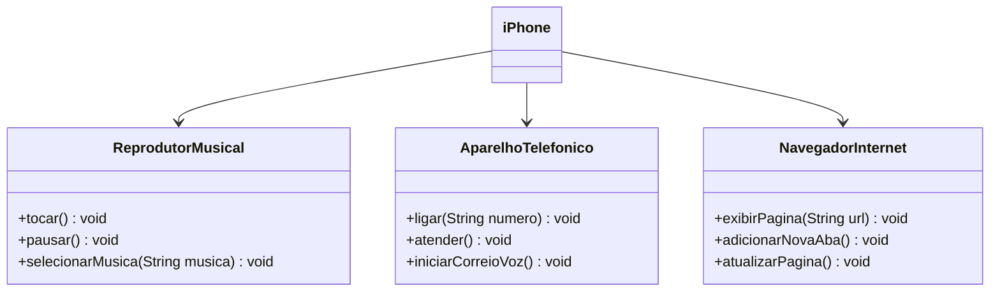

# POO-Desafio
- ### Criar um diagrama UML que represente as funcionalidades descritas acima
- ### Implementar as classes e interfaces correspondentes em Java.

```mermaid
classDiagram
    class ReprodutorMusical {
        +tocar()void
        +pausar()void
        +selecionarMusica(String musica)void
    }

    class AparelhoTelefonico {
        +ligar(String numero)void
        +atender()void
        +iniciarCorreioVoz()void
    }

    class NavegadorInternet {
        +exibirPagina(String url)void
        +adicionarNovaAba()void
        +atualizarPagina()void
    }

    class iPhone {
    }

    iPhone --> ReprodutorMusical
    iPhone --> AparelhoTelefonico
    iPhone --> NavegadorInternet
```
